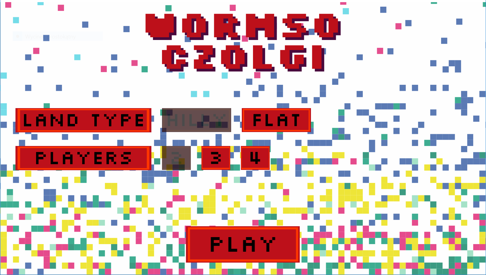
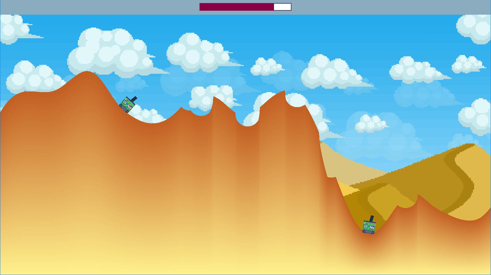
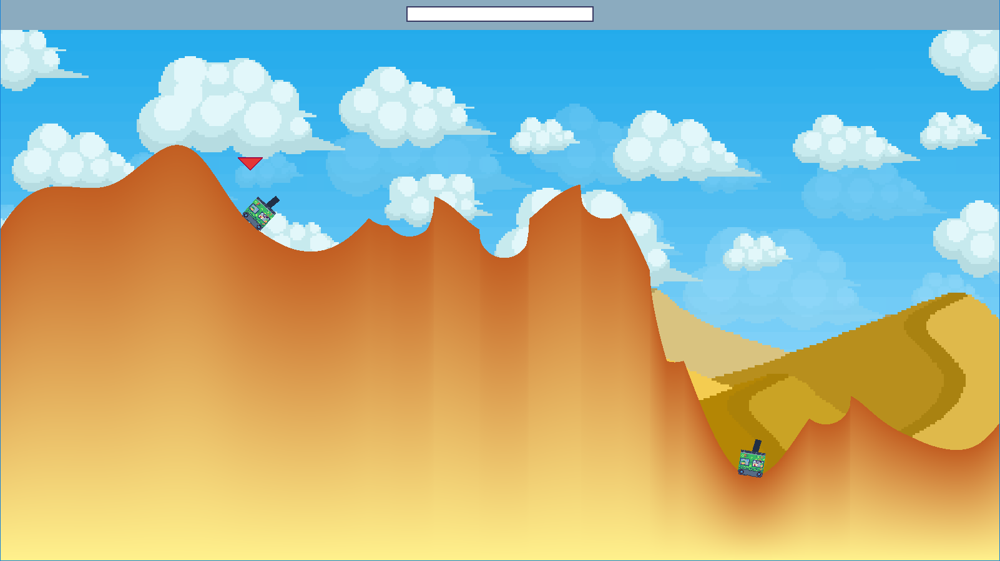

# Game C++ - Worms Tanks (org. Pocket Tanks)

Jest to jedna z pierwszych moich gier stworzonych w całości przy użyciu języka c++ oraz biblioteki SFML. Inspiracją do stworzenia gry była w oryginale gra znana jako "Pocket Tanks" gdzie problemem był nie tylko przeciwnik, z którym toczymy potyczke ale również zmienny teren. Gra jest wyszczuplonym klonem swojej oryginalnej wersji z zachowaniem kluczowych elementów rozgrywki np. algorytmicznie generowany teren.

## Opis sposobu generowania terenu

W swojej oryginalej wersji gra posiada algorytmicznie losowo generowany teren, który zmiennia się wraz z każdą rozgrywką. W grze "Worms Tanks" problematyka losowo generowanego terenu została rozwiązana poprzez sastosowanie algorytmu Perlin Noise ([Więcej szczegółów oraz dokładny algorytm działania](https://flafla2.github.io/2014/08/09/perlinnoise.html)), który idealnie spełnił moje oczekiwania. Rozwiązywał problem generacji zbyt różnorodnych komórek terenu sąsiadujących ze sobą przez co mapa była mało estetyczna oraz posiadała liczne sciany pionowe, przeskoki (generalnie była chaotyczna po prostu losowa). Dopiero zastosowanie szumu Perlina pozwoliło okiełznać losowe generowanie terenu i uzyskanie smukłej mapy z możliwością ustawienia rodzaju terenu. 

Teren został wygenerowany stosując generację dolnej warstwy ograniczającej teren oraz stosując szum Perlina górnej wartswy kształtującej całość terenu. Następnie wartswy zostały połączony sosując jeden z kszatłtów "prymitywnych" o nazwie "triangle strip".

## Zdjęcia z gry

